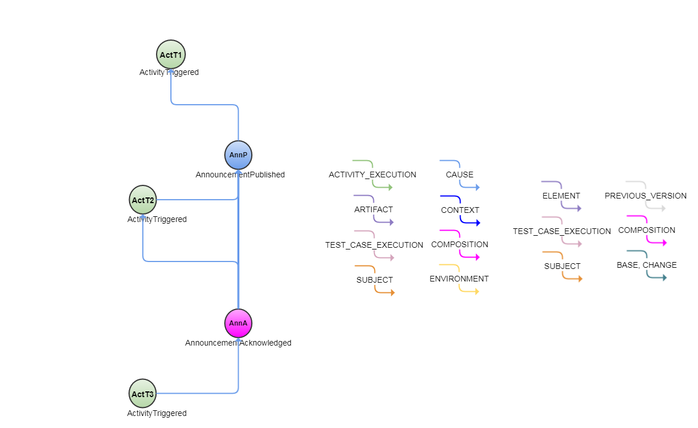

<!---
   Copyright 2017 Ericsson AB.
   For a full list of individual contributors, please see the commit history.

   Licensed under the Apache License, Version 2.0 (the "License");
   you may not use this file except in compliance with the License.
   You may obtain a copy of the License at

       http://www.apache.org/licenses/LICENSE-2.0

   Unless required by applicable law or agreed to in writing, software
   distributed under the License is distributed on an "AS IS" BASIS,
   WITHOUT WARRANTIES OR CONDITIONS OF ANY KIND, either express or implied.
   See the License for the specific language governing permissions and
   limitations under the License.
--->

# Aliveness Monitoring Example
 
This example discusses how Service and Protocol Monitoring can be implemented using Eiffel event

# Introduction
 
In a continuous integration and delivery pipeline, the availability of the IT/Cloud infrastructure & Services that interact with the pipeline are critical components for the availability of CI/CD activities & productivity.
For example, what if a Cloud environment orchestrator became unavailable due to an unplanned/unforeseen incident, how would this outage impact the dynamic creation or removal of resoures for the CI/CD?
Or suppose that the target of your artifact's deployment suddenly lost storage connectivity, how would this affect the CI/CD, would it fail and require manual intervention to get it back up and running?
Wouldn’t it be good if this type of information was made readily available to your CI/CD automatically, so that contingency plans may be implemented to prevent something breaking or to at least mitigate the impact of an outage affecting the CI/CD.
Facilitating for the integration of observational activities and subsequent notification into a CI/CD in an automated fashion is highly desirable.
This may be achieve by utilizing the EiffelAnnounmentPublishedEvent AnnP and EiffelAnnounmentAchnowledgedEvent as a synchronous partner pair.
For example, suppose there is an activity that publishes an EiffelAnnouncementEvent containing information that something has happened (e.g Service A is down) which is subsequently consumed and triggers another activity that publishes an EiffelAnnouncementAcknowledgedEvent  acknowledging that Service A is down ("first responder" acknowledgement)
The first responder entity may for example be used to trigger subsequent Activities to resolve the impact of "Service A is down" or may be used to pause your CI/CD activity until a  EiffelAnnounmentPublishedEvent is published with information stating a modified status of Service A (e.g "Service A is Alive") indicating that the problem has been resolved.

A JSON array of all events used in this example can be found "here"

## Event Graph

# Event-by-Event Explanation

# ActT1
EiffelActivityTriggeredEvent (ActT), representing that monitoring activities has been triggered.

# AnnP
EiffelAnnouncementPublished (AnnP) in this example representing an announcement that something has happened (e.g Service A is down). Using it's CAUSE link, the EiffelAnnouncementPublished AnnP declares that it is part of the previous monitoring Activity.

# ActT2
EiffelActivityTriggeredEvent (ActT) in this example representing that monitoring activities have been triggered as a result of the previous EiffelAnnouncementPublished AnnP. Using it CAUSE link, the EiffelActivityTriggeredEvents ActT2 declares that is CAUSED by AnnouncementPublishedEvent AnnP.

# AnnA
EiffelAnnouncmentAcknowledged (AnnA) in this example representing the acknowledgement of the EiffelAnnouncementPublishedEvent. Using it CAUSE link, the EiffelAnnouncmentAcknowledged AnnA declares that is part of the previous activity and is CAUSED by AnnouncementPublishedEvent AnnP

# ActT3
EiffelActivityTriggeredEvent(ActT), in this example representing triggering activities. Using its CAUSE link, the EiffelActivityTriggeredEvents ActT3 declares that it is CAUSED by EiffelAnnouncmentAcknowledged AnnA.