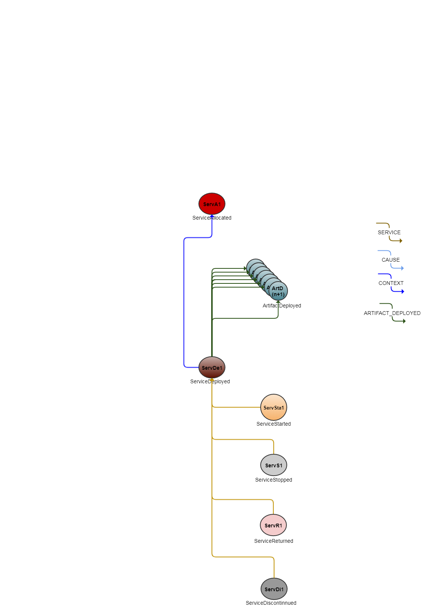

<!---
   Copyright 2019 Ericsson AB.
   For a full list of individual contributors, please see the commit history.

   Licensed under the Apache License, Version 2.0 (the "License");
   you may not use this file except in compliance with the License.
   You may obtain a copy of the License at

       http://www.apache.org/licenses/LICENSE-2.0

   Unless required by applicable law or agreed to in writing, software
   distributed under the License is distributed on an "AS IS" BASIS,
   WITHOUT WARRANTIES OR CONDITIONS OF ANY KIND, either express or implied.
   See the License for the specific language governing permissions and
   limitations under the License.
--->

# Artifact deployment lifecycle Example
 
This example discusses how the traceability of an artifact's deployment lifecycle can be implemented using Eiffel events.
 
# Introduction
To understand the lifecycle of an artifact we must go back and start at the source.
The origins of an artifact begin with the first checkin of code. Over time multiple commits & mergers culminate in the first built version of an artifact.
This new artifact then goes through testing to ensure that the desired functionality and quality level etcera of the artifact has been achieved.
Once this has been established the artifact is released and deployed into Operations where it lives until it is replaced by another version and then finally it is discontinued from use altogether.
Having the capability to track & trace the entire lifecycle of artifacts is highly desirable in a CI/CD context.
In the context of continuous deployment, track and trace may be achieved by employing events such as EiffelServiceDeployedEvent, EiffelArtifactDeployedEvent & EiffelServiceStartedEvent.

## Event Graph

# Event-by-Event Explanation

# ServA1
The EiffelServiceAllocatedEvent is to declare an instance has been allocated to a User.( e.g global scheduler or resource booking tool).

# ArtD(n+1)
The EiffelArtifactDeployedEvent declares that an artifact has been deployed into an environment.

# ServD1
The EiffelServiceDeployedEvent is to declare when a configuration item/VM and/or Service has been deployed by a machine/human. It implies that the service is not in a running state and is ready to be started.
Using its ARTIFACT_DEPLOYED link, the EiffelServiceDeployedEvent (ServD1) declares links ArtD(n+1) events.

# ServSta1
The EiffelServiceStartedEvent is to declare that a Service has been started and is running.
Using its SERVICE link, the EiffelServiceStartedEvent (ServSta1) declares a link to EiffelServiceDeployedEvent (ServD1).

# ServSto1
The EiffelServiceStoppedEvent is to declare that a Service has been stopped.
Using its SERVICE link, the EiffelServiceStoppedEvent (ServSto1) declares a link to EiffelServiceDeployedEvent (ServD1).

# ServR1
The EiffelServiceReturnedEvent is to declare that a Service Instance (e.g VM) has been returned from use.
Using its SERVICE link, the EiffelServiceReturnedEvent (ServR1) declares a link to EiffelServiceDeployedEvent (ServD1).

# ServDi1
The EiffelServiceDiscontinuedEvent is to declare that an activity to tear down a Service Instance has completed. The tear down of a service instance may be exectuted by a Cloud Orchestractor/scheduler.
Using its SERVICE link, the EiffelServiceDiscontinuedEvent (ServDi1) declares a link to EiffelServiceDeployedEvent (ServD1).

# Metrics and Tracability examples
There's a multitude of metrics that are relevant to measure in a continuous integration and delivery pipeline, for various purpose and for various stakeholders. An exhaustive list is impossible, but a few examples and how they may be collected using Eiffel events are presented below.

## Follow my commits
Developers commit code, build, test and deploys features and/or bug fixs into Operations. Measuring the frequency & time taken for commits and their subsequent progression until deployed into operations provides significant insights into the efficiency and bottlenecks in a team's E2E CI/CD processes.

## Cloud Resource utilization
Why tear down a working environment containing artifacts and services when they can be reused again and again by other test activities? 
Resharing resources such as VM's and/or Services in a test environment leads to increased eifficiency of Cloud Resource deployment & utilization.
Utlizing EiffelServiceReturnedEvent and EiffelServiceAllocatedEvents to declare the status of Test environments assists workflow orchestrators in getting the most from available resources.

